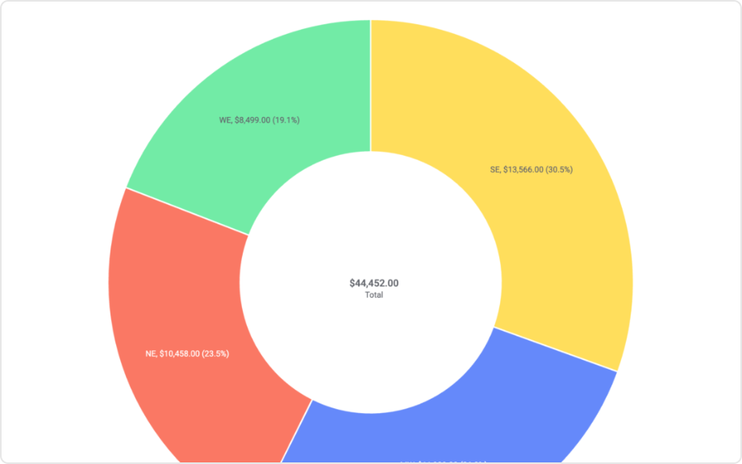

# Donut Chart Mod for Spotfire®

The donut chart is functionally identical to a pie chart, with the exception of a blank center and the ability to support multiple statistics at once. It provides a better data intensity ratio to standard pie charts since the blank center can be used to display additional data.

## Installation & Use

[Download latest version](https://github.com/spotfiresoftware/spotfire-mod-donut/releases)

The [Wiki](https://github.com/spotfiresoftware/spotfire-mod-donut/wiki) contains step-by-step instruction on how to install and use this Mod in Spotfire®.

## Building the Project

In a terminal window:
- `npm install`
- `npm start`

In a new terminal window:
- `npm run server`

## About Mods for Spotfire®
-   [TIBCO Community Exchange](https://community.tibco.com/s/global-search/%40uri#q=mod%20for%20tibco%20spotfire&t=Exchange&sort=date%20descending): A safe and trusted place to discover ready-to-use mods
-   [Developer documentation](https://tibcosoftware.github.io/spotfire-mods/docs/): Introduction and tutorials for mods developers
-   [Mods examples](https://github.com/TIBCOSoftware/spotfire-mods/releases/latest): A public repository for examples projects
